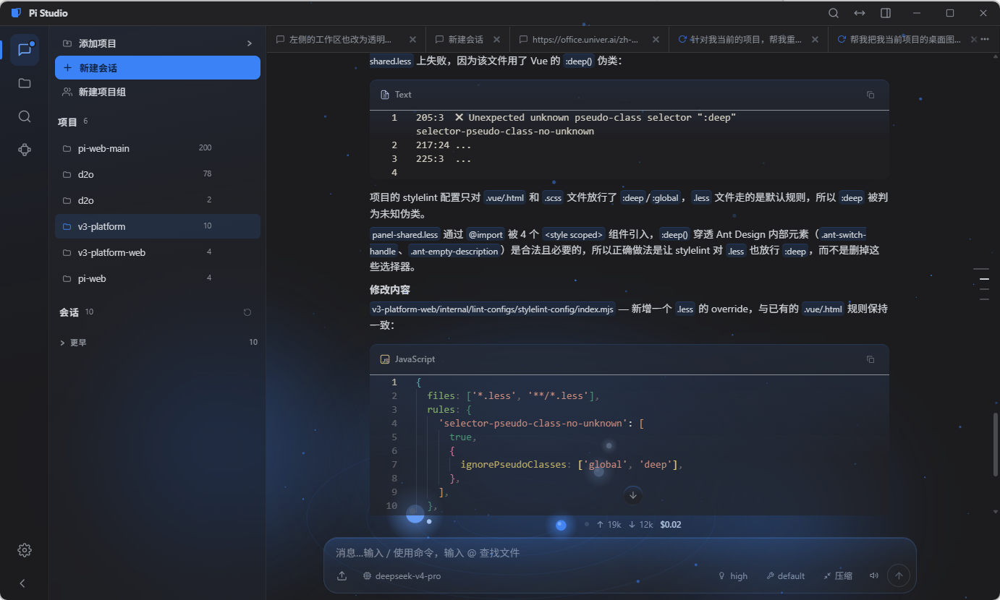
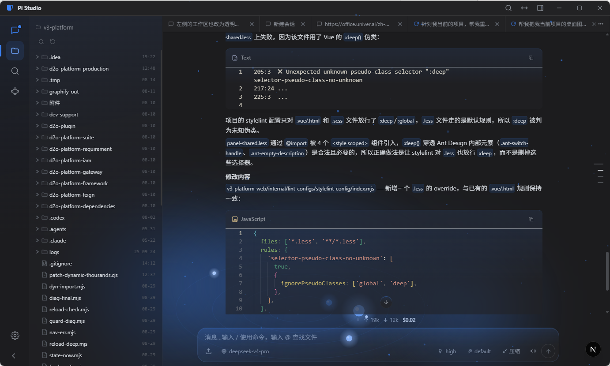
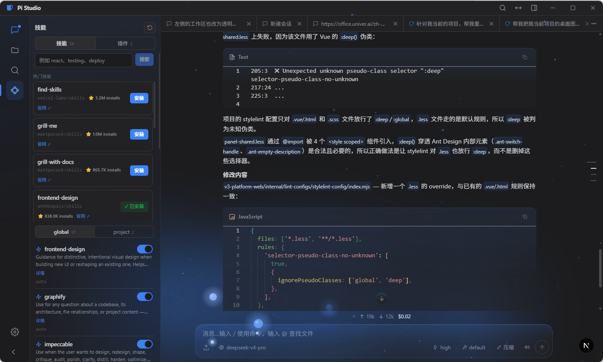
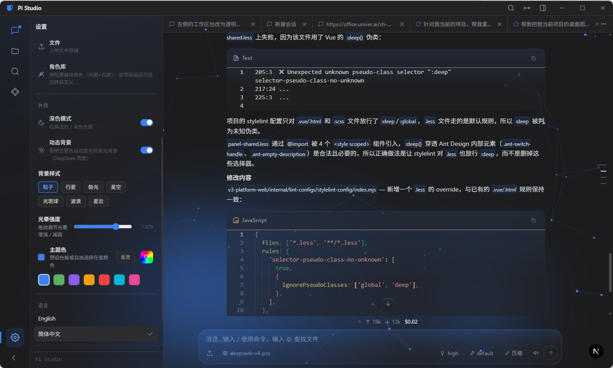
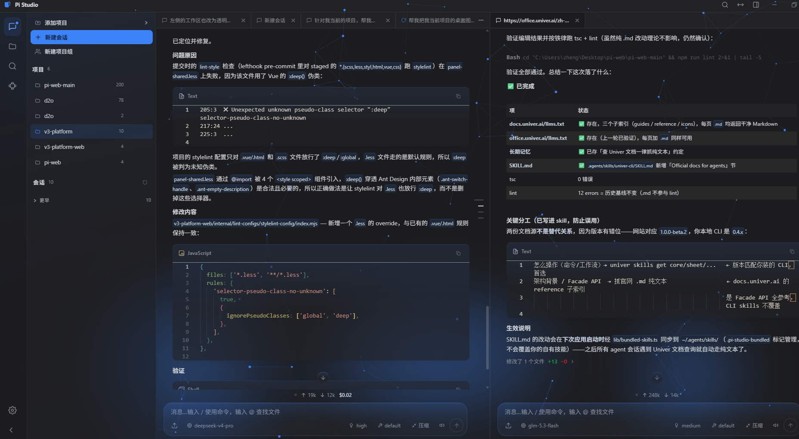
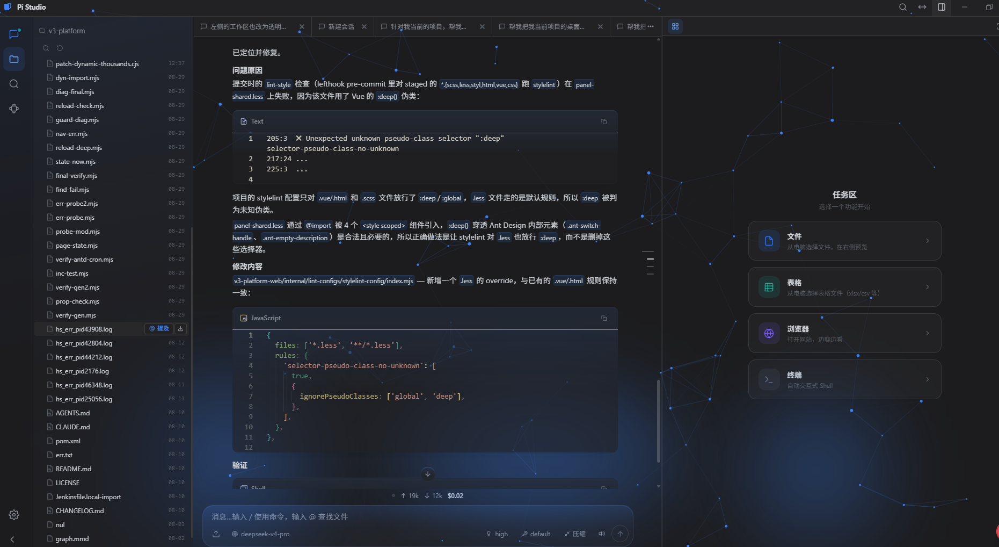

# Pi Studio

**Pi Studio** 是 [pi 编程智能体](https://github.com/badlogic/pi-mono) 的桌面级工作台——一条命令启动，
在浏览器或桌面窗口里管理你的全部 AI 会话，还能让智能体直接操作**表格、文档、PPT 和真实网页**。

与 pi CLI 共享同一套会话、模型与技能配置（`~/.pi/agent`），互相无缝衔接。基于
[agegr/pi-web](https://github.com/agegr/pi-web) 二次开发。

```bash
npx @aacs111/pi-studio@latest      # 无需安装，直接运行（Node.js ≥ 22.19）
```








## 它能做什么

- **会话工作台（核心）** — 按项目浏览历史 pi 对话，fork / 会话内分支 / 随时接续；模型、认证、思考级别、
  技能开关都在 UI 里管理，不必碰终端。iMessage 风格玻璃聊天流：打字机式流式渲染、思考+工具折叠组、
  每轮变更文件卡与逐文件 diff 统计。
- **内置完整表格引擎（Univer）** — 就地查看/编辑 `.xlsx` / `.univer`：公式、条件格式、数据验证、筛选
  全部可用。对智能体说一句「改这张表」，它在 git worktree 草稿里编辑，你实时预览、一键合并或丢弃——
  **从不未经你同意写回原件**。
- **办公文档两段式** — `.docx` / `.pptx` 原生预览；点「AI 编辑」转入 .univer 草稿让智能体改写，
  完成后导回原件格式。
- **智能体可驱动的内置浏览器** — 右侧原生浏览器面板，智能体通过语义接口自动填表、点击、抓取内容、
  验证页面。「网页上的活」也能自动化。
- **项目组：多智能体协作** — 把任务交给一支角色团队（组长/产品/开发/测试…）：引擎自动计划任务 DAG、
  按依赖并行派发、失败自动返工，群聊实时可见谁在干什么；执行全程留痕、可回放，写权限分档防止角色
  越权改代码。
- **桌面应用** — Electron 打包的 Windows 应用（安装版 / 便携版 / msi），内置服务只监听本机。
- **安全内建** — Origin/Host 校验、可选 Basic Auth、路径防穿越 + realpath 写防护、文件访问允许列表、
  项目信任门控。

## 两种运行形态

| | 浏览器模式 `npx pi-studio` | 桌面模式（Electron 应用） |
|---|---|---|
| 会话 / 表格 / 文档 / 项目组 | ✅ 全部可用 | ✅ 全部可用 |
| 智能体驱动浏览器 | ❌ 沙箱 iframe，无控制桥 | ✅ 原生 WebContentsView + 语义控制桥 |
| 适合 | 快速上手、远程访问 | 日常使用、网页自动化 |

## 功能特性

### 表格编辑（基于 Univer）

- **浏览器里查看和编辑 Excel 文件**：在完整的 Univer 表格引擎中打开 `.xlsx` / `.univer` ——公式、
  条件格式、数据验证、筛选、排序、表格、超链接、批注、话题评论全部就地可用。
- **AI 编辑你打开的表格**：一键把上传的 `.xlsx` 转成 `.univer` 草稿，告诉智能体要改什么，右侧面板
  实时查看结果。
- **Worktree 安全保障**：表格草稿放在 git worktree 里——随时创建、提交、丢弃或合并回主干。未经你
  明确同意，绝不自动写回。
- **写回 / 导出**：把编辑提交回原 `.xlsx`（经 SheetJS 重建），或导出为 `.xlsx` / `.csv`。
- **加密工作簿**：标准 OOXML / WPS TSD / WPS 结构加密的 `.xlsx` 通过 WPS KET COM 桥解密并安全缓存。
- **导入压缩**：34 MB 的 `.univer` 导入后通常可压缩到约 10 MB。

### 办公文档（.doc / .docx / .ppt / .pptx）

- **打开即原生预览**：Word 文档渲染为可读 HTML，PPT 走隐藏缓存只读预览，与表格体验一致。
- **AI 编辑**：点一下「AI 编辑」，文档/PPT 转入 .univer 草稿进入与表格相同的工作流——智能体改写、
  你实时预览、worktree 隔离、确认后导出回 `.docx` / `.pptx` 交付原件。

### 项目组：多智能体协作

- **一键组建团队**：侧栏「新建项目组」，配置角色（组长/产品/开发/测试…或自定义），每个角色可配
  模型、工具、技能与轮次/超时预算。
- **DAG 编排引擎**：入口角色先提交任务计划（有向无环图，工具层校验无环），引擎按依赖就绪集波次
  派发——无依赖任务真并行，失败附反馈自动返工（上限可配），重试耗尽级联跳过下游防死锁；计划
  校验失败自动回退经典流程，永不断粮。
- **群聊实时可见**：每个角色的思考流水与产出实时流入群聊；思考落盘为可读 `.md`（结论+交接+真实
  变更清单），下游角色读产物指针而非原始会话文件。
- **全程留痕、可回放**：Event Sourcing——一切状态变化都是事件，全程可审计；每次执行可打开回放
  看完整轨迹。
- **边界与安全**：写权限分档（`all` / `docs` / `none`），文档角色在工具层拿不到代码编辑权；角色只能
  通过受控工具影响状态；群聊自动核对「假宣称」（宣称改了 X 但变更集里没有 X 会标记出来）。
- **人在环路**：运行中可随时 steer（插话引导）、approve/reject（审批闸门）、cancel；任务派发与
  返工原因在群聊里明示，不是黑盒。

### 会话与聊天工作台（核心）

- **随时接着干**：按项目浏览历史 pi 对话，不必翻终端历史或会话路径。
- **安全尝试不同方向**：从更早的消息继续，或把会话 fork 成独立路线。
- **跨分支工作**：在侧栏切换 Git worktree，新会话和文件资源管理器跟随所选 checkout。
- **一边聊天一边看代码**：左侧浏览文件，右侧预览源码、文档、图片、音频和 PDF。
- **会话状态一目了然**：上下文用量、成本、压缩状态、系统提示详情都在顶栏可见。
- **变更文件卡片**：每轮智能体回合结束后，汇总卡片列出所有编辑/写入的文件及 `+N`/`-M` 逐文件 diff
  统计；生成的文件自动推到右侧面板打开。
- **少在终端配配置**：模型、登录/API key、模型测试、插件、skill 开关都在 Web UI 里管理。
- **完成提示音**、会话搜索、命令面板、玻璃质感主题背景。

### 智能体驱动的内置浏览器（Semantic Browser V2）

> 仅 Electron 桌面模式可用。

- **原生渲染**：每个网页标签一个 `WebContentsView`，真实浏览器体验，不是截图式自动化。
- **语义控制桥**：`/snapshot` 返回每个元素的 `ref/role/name/value`；评分定位器（精确文本 > aria >
  placeholder > testid > contains）解析元素，歧义时返回 `409` + 候选，让智能体「看得懂」页面。
- **批量执行**：`/execute` 在单个 JS 上下文中完成多步动作（fill / select / click / check / wait /
  assert），高级动作支持原生下拉与 Ant Design / Element Plus combobox。
- **网页预览推送**：智能体可以把 URL 推到右侧面板，边聊边看。
- **CDP 远程调试**：默认 `127.0.0.1:9222`（`PI_WEB_CDP_PORT` 可改，设 `0` 关闭）。

### 上传、视觉与文件工具

- **上传管理器**：把 `.xlsx` / `.univer` / 图片放入隔离存储区，可切换存储位置并查看容量统计。
- **视觉描述**：让智能体描述图片；视觉模型（从你的自定义提供商自动检测）生成描述。
- **文件索引**：快速项目文件搜索，快速把智能体和资源管理器指到正确的文件。
- **打开文件标记**：右侧面板当前打开的文件会暴露给智能体，所以只说「编辑这张表」就能对上号。
- **终端面板**：内置 xterm 终端，不用离开工作台。

### 界面与体验

- **主题色系统**：预设色板 + 自定义取色，自动派生配套色（hover / 软底色 / 用户消息气泡），底色
  始终保持中性。
- **深浅色主题** + 玻璃质感界面、动态背景。
- **国际化**：英文 / 简体中文一键切换，见 [国际化](./docs/i18n.md) 新增语言。
- **PWA**：移动端和桌面端都可把 Pi Studio 安装为离线可用的应用。

### 安全

- **Origin/Host 校验**：每个 API 请求都校验（CSRF 防护）；非 API 页面校验 Host。
- **可选 HTTP Basic Auth**：设置 `PI_WEB_PASSWORD` 即可保护 Web 界面和所有 API 端点（用户名固定
  `pi`，timing-safe 哈希比较）。
- **路径防穿越 + realpath 写防护**：文件浏览和写入限定在允许列表内，symlink 指向外部也写不穿；
  上传文件名消毒。
- **bash 输出防护**：大命令输出临时文件走白名单 + 符号链接防护，且必须被会话真实引用。
- **浏览器控制桥鉴权**：可执行任意页面 JS 的控制接口同样受来源校验保护。
- **上传配额**：默认 300 MB，按 LRU 清理。
- **项目信任门控**：项目级 skill（`.agents/skills`）只在项目被信任后加载（`~/.pi/agent/trust.json`，
  与 pi CLI 共享）。

## 快速开始

Pi Studio 要求 Node.js 22.19.0 或更高版本。可通过 `node --version` 检查当前版本。

**无需安装，直接运行：**

```bash
npx @aacs111/pi-studio@latest
```

**或全局安装后使用：**

```bash
npm install -g @aacs111/pi-studio
pi-studio
```

启动后打开 [http://127.0.0.1:30141](http://127.0.0.1:30141)。命令行版本会在服务就绪后尝试自动打开
浏览器。Pi Studio 默认仅监听 `127.0.0.1`。

**可选参数：**

```bash
pi-studio --port 8080              # 自定义端口
pi-studio --hostname 0.0.0.0       # 在可信网络中开放访问
pi-studio -p 8080 -H 0.0.0.0       # 组合使用
pi-studio --no-open                # 不自动打开浏览器

PORT=8080 pi-studio                # 也支持环境变量
PI_WEB_HOSTNAME=0.0.0.0 pi-studio  # 显式开放网络访问
PI_WEB_ALLOWED_HOSTS=pi-studio.internal pi-studio  # 允许指定的代理或自定义主机名
PI_WEB_PASSWORD='足够长的随机密码' pi-studio  # 启用 Basic Auth（用户名固定为 pi）
PI_WEB_NO_OPEN=1 pi-studio         # 适用于后台服务或开机自启
```

设置 `PI_WEB_PASSWORD` 可为 Web 界面和所有 API 端点启用 HTTP Basic Auth。用户名固定为 `pi`。不设置或
留空即关闭认证。

Pi Studio 可以调用高权限智能体。Basic Auth 不会加密传输中的密码，请勿把纯 HTTP 暴露到公网。远程访问
请通过可信反向代理的 HTTPS 或可信 VPN。
API 请求接受回环名称、IP 字面量、选定的绑定 hostname，以及 `PI_WEB_ALLOWED_HOSTS` 中以逗号分隔的精确
名称。当可信反向代理使用了不同的外部 hostname 时，请配置该变量。

## 桌面应用（Electron）

Pi Studio 以 Windows 桌面应用形式发布，右侧浏览器由原生 `WebContentsView` 驱动（见[功能特性](#功能特性)）。
从源码构建：

```bash
pnpm run pack:dir       # release/ 下的未打包目录（最快验证）
pnpm run pack:portable  # 单文件便携版 .exe
pnpm run pack:nsis      # 安装版 .exe
pnpm run pack:msi       # .msi
pnpm run pack           # 安装版 + 便携版
```

打包使用独立构建目录（`.next-pkg`），与 `pnpm run dev` 互不干扰。打包后的应用把内置 Next 服务跑在随机
localhost 端口，数据存放在 `%APPDATA%/Pi Studio/pi-web-uploads`（Program Files 不可写），退出时清理
整棵子进程树。

## HTTP 代理

Pi Studio 读取标准 `HTTP_PROXY`、`HTTPS_PROXY`、`NO_PROXY` 环境变量用于服务端模型和 API 请求。

macOS / Linux：

```bash
HTTP_PROXY=http://127.0.0.1:7890 \
HTTPS_PROXY=http://127.0.0.1:7890 \
NO_PROXY=localhost,127.0.0.1 \
npx @aacs111/pi-studio@latest
```

Windows PowerShell：

```powershell
$env:HTTP_PROXY = "http://127.0.0.1:7890"
$env:HTTPS_PROXY = "http://127.0.0.1:7890"
$env:NO_PROXY = "localhost,127.0.0.1"
npx @aacs111/pi-studio@latest
```

## 说明

- **数据目录**：上传文件和内部状态存放在可配置数据目录——默认 `<项目>/pi-web-uploads/`（可用
  `PI_WEB_UPLOADS_DIR`、`.pi-web-config.json` 或上传管理器 UI 覆盖）。旧数据从 `~/.pi/agent/pi-web-*`
  启动时迁移一次。
- **会话文件**：Pi Studio 默认读取 `~/.pi/agent/sessions`，文件存为
  `~/.pi/agent/sessions/<encoded-cwd>/<timestamp>_<uuid>.jsonl`。设置 `PI_CODING_AGENT_DIR` 可指向其他
  pi agent 目录。
- **模型配置**：模型面板读写 pi agent 目录下的 `models.json`，并与 pi 的 `AuthStorage` 提供商认证合并
  展示；支持模型目录预设、上游模型发现与连通性测试。
- **文件访问**：文件浏览和预览限定在所选项目目录与会话中出现的工作目录。
- **Git worktrees**：切换器何时出现、新 worktree 如何创建、删除会做什么，见
  [Pi Studio 中的 Worktrees](./docs/worktrees.zh-CN.md)。
- **Fork vs 会话内分支**：Fork 创建新的 `.jsonl` 文件；「从这里编辑」在同一会话文件内另开分支。
- **国际化**：见 [国际化](./docs/i18n.md) 了解翻译使用与新增语言/界面文案。

## 开发

开发需 Node.js ≥ 22.19 与 pnpm ≥ 11（本仓库用 pnpm 管理依赖，`package.json` 已钉版本，
安装过 corepack 的可用 `corepack enable` 自动取用）。

```bash
pnpm install
pnpm run dev
```

本地开发服务器运行在 [http://127.0.0.1:10141](http://127.0.0.1:10141)。给 AI 助手/贡献者的开发约定
（协作铁律、架构速查、测试方式）见 [AGENTS.md](./AGENTS.md) 与 [docs/agents/](./docs/agents/)。

常用检查：

```bash
node_modules/.bin/tsc --noEmit
pnpm run lint
```

开发期间不要运行 `next build` / `pnpm run build`——它会写 `.next/` 并干扰 dev server；构建留给发布流程。

## 项目结构

```text
app/
  api/
    agent/          # 创建/驱动 AgentSession 并暴露 SSE 事件
    auth/           # OAuth 与 API key 管理
    browser/        # 右侧网页预览标记 + 控制桥透传（仅 Electron）
    cwd/            # 可浏览/可校验的工作目录选择器
    default-cwd/    # pi 默认工作目录查询
    file-index/     # 项目文件搜索索引
    files/          # 文件列出、读取、预览、监听、保存
    git/            # diff 与 status 端点（变更文件卡片）
    models/         # 可用模型、默认模型、思考级别
    models-config/  # 读写 models.json、模型目录/发现/测试
    open-file/      # 右侧面板活动文件标记（agent 默认编辑目标）
    open-file-request/ # agent 推送生成文件到右侧面板
    plugins/        # 包插件管理
    project-trust/  # 项目信任门控（.agents/skills）
    projects/       # 项目列表/删除（含级联清理会话）
    sessions/       # 会话读取、重命名、删除、上下文、HTML 导出
    skills/         # skill 列出、搜索、安装、更新检查/更新、启停
    teams/          # 项目组多智能体：运行/事件 SSE/审批/steer/取消
    terminal/       # 内置终端（node-pty）
    univer/         # .univer 查看/导出/写回 + worktree 生命周期 + 文档/PPT 预览
    uploads/        # 隔离上传存储管理
    vision/         # 视觉模型描述图片
    worktrees/      # git worktree 创建/删除
components/
  AppShell.tsx          # 主布局、URL 状态、顶部面板、文件标签
  SessionSidebar.tsx    # 项目选择、会话树、搜索、Explorer
  ChatWindow.tsx        # 消息区、SSE、拖拽图片、minimap、懒加载
  percho/               # iMessage 玻璃聊天流（打字机渲染、折叠组、TurnDiffChip、TOC）
  TeamChat.tsx          # 项目组群聊视图
  TeamSettings.tsx      # 角色/编排/预算配置
  WorkflowEditor.tsx    # 可视化工作流编辑（react-flow）
  RunReplayModal.tsx    # 执行回放
  TerminalPanel.tsx     # 内置终端面板
  FileViewer.tsx        # 源码、diff、图片、音频、PDF、DOCX、PPT 预览
  XlsxViewer.tsx        # Univer 表格引擎查看 .xlsx
  UniverFileViewer.tsx  # .univer worktree 就地 diff 应用查看器
  WebViewer.tsx         # 右侧浏览器标签（仅 Electron WebContentsView）
  DraggableResizableModal.tsx # 统一可拖动/缩放弹窗
  ModelsConfig.tsx / SkillsPanel.tsx / PluginsConfig.tsx / SettingsPanel.tsx
lib/
  rpc-manager.ts        # AgentSessionWrapper 生命周期与全局 registry
  session-reader.ts     # 解析 .jsonl 会话文件与分支上下文
  team/                 # 项目组多智能体运行时（EventStore/DAG 调度/LLM judge/黑板/worktree）
  i18n/                 # en / zh-CN 消息注册表
  model-scope.ts        # enabledModels 作用域解析（minimatch glob）
  provider-listing.ts   # 能力驱动的提供商列表
  file-access.ts        # 文件读取/写入安全边界（含 realpath 防护）
  storage-config.ts     # 上传/数据目录解析
  univer-cli.ts         # univer daemon + CLI 集成
  univer-db.ts          # 直接 SQLite 读 worktree/提交状态
  ket-bridge.ts         # 加密 .xlsx 的 WPS KET COM 解密桥
  http-dispatcher.ts    # 全局 undici dispatcher（空闲超时）
  request-security.ts   # API 请求的 Origin/Host 校验
  web-auth.ts           # 可选 HTTP Basic Auth
hooks/
  useAgentSession.ts    # 会话加载、发送命令、SSE 状态机
  useAccentColor.ts     # 主题色系统（预设/取色 + 派生变量）
  useTeamRun.ts         # 项目组运行 SSE 订阅
electron/
  main.cjs              # 桌面主进程：next 子进程 + WebContentsView 池 + CDP
  bridge.cjs            # Semantic Browser V2 控制桥（HTTP）
bin/
  pi-studio.js          # npm CLI 入口
.agents/skills/         # 项目技能：browser-control / sheet-edit / office-edit / univer-cli /
                        # univer-integrate / web-preview
```

## License

MIT — 见 [LICENSE](./LICENSE)。基于 [pi-web](https://github.com/agegr/pi-web)（作者
[agegr](https://github.com/agegr)）二次开发，后者又构建于 [pi](https://github.com/badlogic/pi)
（作者 [badlogic](https://github.com/badlogic)）。
